# MySQL_Ecommerce-Data
This is ksmilda's portfolio: Data cleaning and data exploration using MySQL.

## Project Background 
With this project, I'm analyzes an open dataset obtained from Kaggle (link), which contains simulated e-commerce transactions. The dataset includes customer information, order details, product categories, sales values, and other related attributes. Although the dataset does not represent a specific company, it serves as a realistic sample to demonstrate data exploration, KPI tracking, and dashboard building.
The purpose of this analysis is to showcase data cleaning, SQL queries, and visualization skills for business intelligence use cases such as sales monitoring, customer segmentation, and churn analysis. This whole SQL project was executed on the MySQL Server, below is a snapshot of a few of the columns and entries in the [dataset](https://github.com/ksmilda/MySQL_Ecommerce-Data/blob/312f3babf0d8f275bde012918adf4d978993c4c3/E%20Commerce%20Customer%20Insights%20and%20Churn%20Dataset.xlsx).  

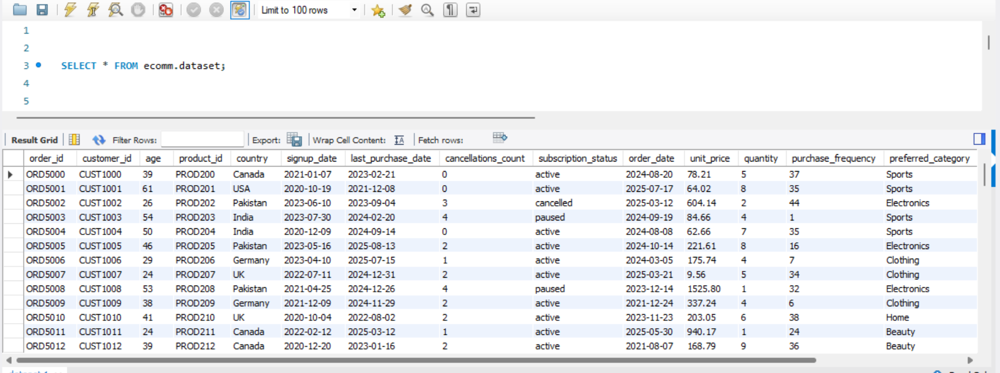

## Data Cleaning
Before the exploration begins, the dataset is checked and cleaned to ensure there are no missing values nor duplicate rows, as documented in [this file](https://github.com/ksmilda/MySQL_Ecommerce-Data/blob/56a4d3774fa5f1b81d371230d57f4ffe25ab50cf/data%20cleaning_E%20Commerce.sql). The process include formatting the data type (normalizing) and setting the column `order_id` as the primary key. 

## Data Exploration
1. Numbers of orders
   - Using this query on MySQL, resulting there are 2000 order based on counting each `order_id` ranging from 2020-09-18       untill 2025-09-20.

     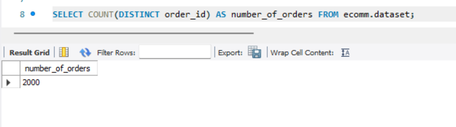

   - The number of orders based on each country.

     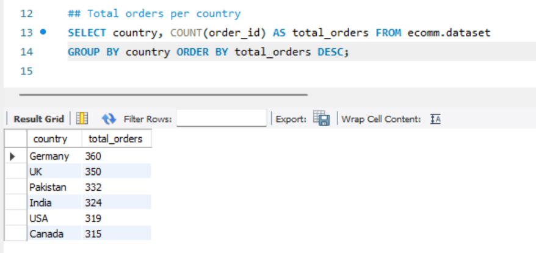

2. Total revenue
   - The total revenue are dolar?2.051.690,65.

     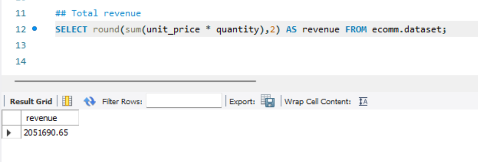

   - The total revenue based on country.

     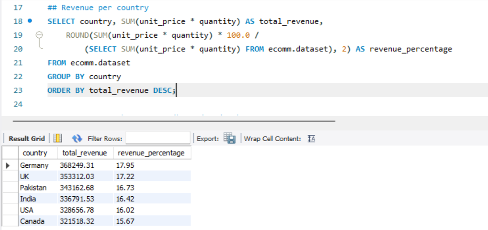

   - Revenue growth per year.

     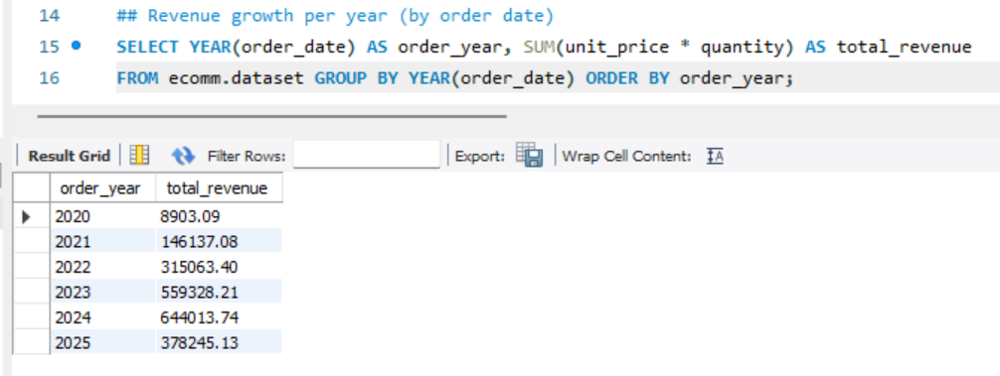

   - Top 5 product based on revenue.

     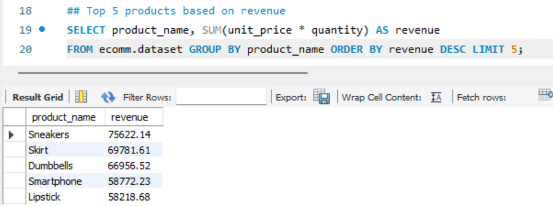

   
3. Average order value (AOV)
   - The Average order value (AOV) are 1.025,85 dolar?.

     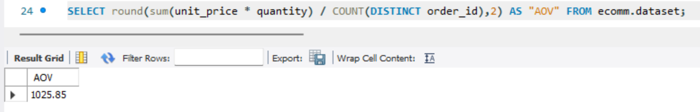

4. Number of customers
   - The number of customers based on subbscription status. 

     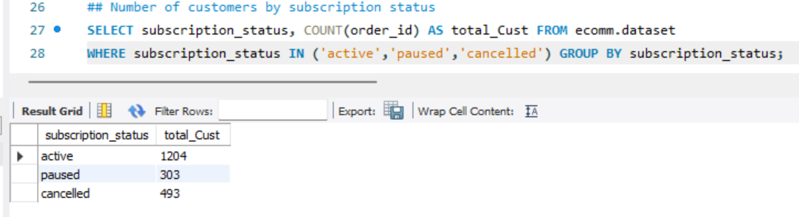

   - Customers with more than 1 cancellation orders,

     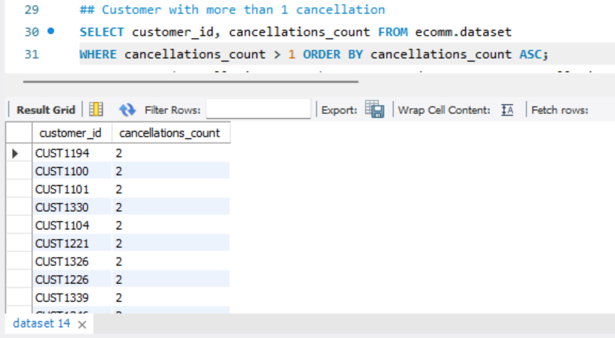

     and the total of it.
     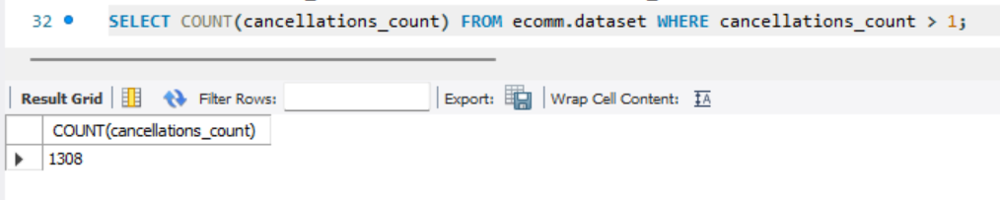
 

      
5. Churn rate (and every country's)
   - The churn rate. 

     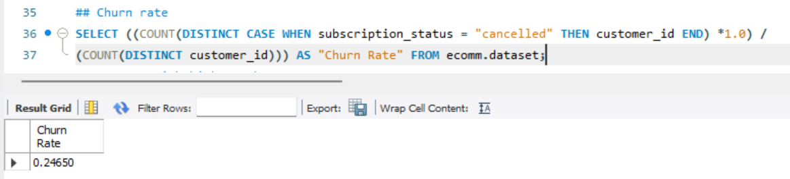

   - The churn rate for each country.

     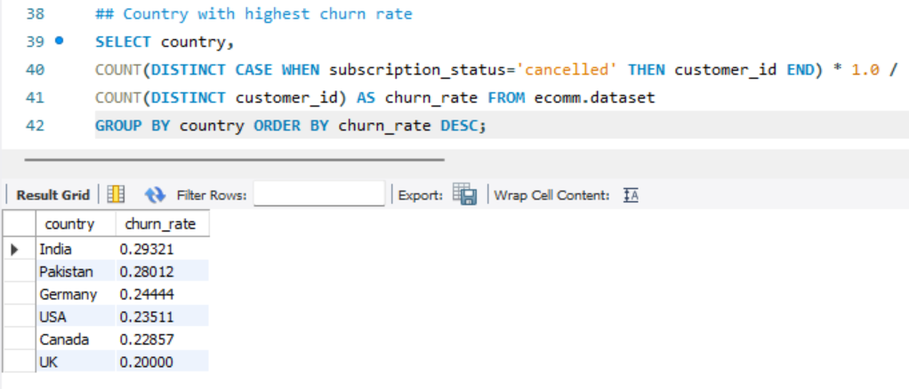

6. Product and Category
8. Average age of customers

12. Average purchase frequency by category
13. Top 5 customers with the most spending and their country
14. 
