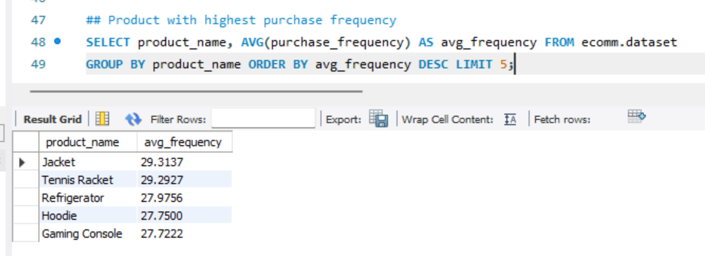
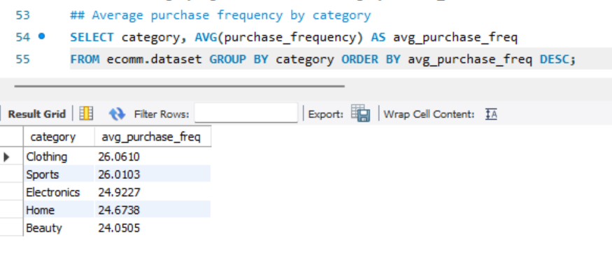

# MySQL_Ecommerce-Data
This is ksmilda's portfolio: Data cleaning and data exploration using MySQL.

## Project Background 
With this project, I'm analyzes an open dataset obtained from Kaggle [link](https://www.kaggle.com/datasets/nabihazahid/e-commerce-customer-insights-and-churn-dataset/data), which contains simulated e-commerce transactions. The dataset includes customer information, order details, product categories, sales values, and other related attributes. Although the dataset does not represent a specific company, it serves as a realistic sample to demonstrate data exploration, KPI tracking, and dashboard building.

The purpose of this analysis is to showcase data cleaning, SQL queries, and visualization skills for business intelligence use cases such as sales monitoring, customer segmentation, and churn analysis. This whole SQL project was executed on the MySQL Server, below is a snapshot of a few of the columns and entries in the [dataset](https://github.com/ksmilda/MySQL_Ecommerce-Data/blob/312f3babf0d8f275bde012918adf4d978993c4c3/E%20Commerce%20Customer%20Insights%20and%20Churn%20Dataset.xlsx).  

## Data Cleaning
Before the exploration begins, the dataset is checked and cleaned to ensure there are no missing values nor duplicate rows, as documented in [this file](https://github.com/ksmilda/MySQL_Ecommerce-Data/blob/56a4d3774fa5f1b81d371230d57f4ffe25ab50cf/data%20cleaning_E%20Commerce.sql). The process include formatting the data type (normalizing) and setting the column `order_id` as the primary key. 

## Data Exploration
With a clean dataset in place, I began the exploratory data analysis (EDA) to better understand the underlying patterns and behaviors within the data. The goal of this stage is not only to summarize key metrics such as revenue, profit, and customer distribution, but also to uncover trends across different segments (e.g., gender, country, and subscription status).

This exploration provides the first set of insights into customer behavior and business performance. The data exploration query can be accessed in [this link](https://github.com/ksmilda/MySQL_Ecommerce-Data/blob/a7ddfdad6be8f39a38bb14e322e5036a58e287aa/data%20exploration_E%20Commerce.sql).

1. Numbers of orders
   - Using this query on MySQL, resulting there were 2000 order based on counting `order_id` ranging from 2020-09-18 untill 2025-09-20.

     

     And the order were increase every year, which may indicate growing customer engagement.
     
     

   - The number of orders based on each country. Picture below showed that country with the most number of orders were Germany with 360 orders.

     

3. Total revenue
   - The total revenue was $2.051.690,65.

     

   - The total revenue based on country as attached below, show that the percentage revenue for each country is relatively balanced, with no single country accounting for more than one-fifth of total sales. This suggests the business has a diversified customer base across markets.

     

   - The revenue growth were increased every year, along with sales growth. This indicates that the growth is being driven by both higher transaction counts and consistent customer spending.

     

4. Average order value (AOV)
   - The Average order value (AOV) for every country means on average each transaction contributes as number below in revenue. Countries like India and Pakistan show higher AOVs, while the UK has a lower AOV.

     

5. Customers demographic
   - The number of customers based on subscription status. 

     

   - Customers with more than 1 cancellation orders,

     

     and the total of it.
     
 
   - Average age of customers.
     
     

   - Gender distribution.
     
     

6. Churn rate (and every country's)
   - The churn rate. 

     

   - The churn rate for each country.

     

7. Product and Category
   - Top 5 product based on revenue.

     

   
   - Product with highest purchase frequency.

     

   - Gender distribution by purchase category.

     

   - Average purchase frequency by category.

     

   - Top 5 customers with highest spending and their country.

     

## Conclusion
